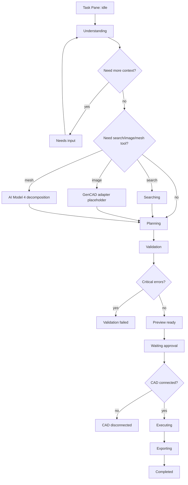

# ORYND CAD Bridge Component-First Code Design Prompt

This file is a copy-paste prompt for a future Codex/Claude/Codex-like coding
session. It is intentionally focused on code-design, component structure,
screen states, and prototype files.

It is not the same task as "make a pretty screen". The task is to build the
interface as a system: reusable components, explicit states, separate screens,
HTML prototypes, mock data, and implementation-ready UI contracts.

Working product names:

- ORYND CAD Bridge
- ORYND External CAD Extension

Do not call the product "Supernova plan". `Supernova plan/` is only the owner
planning folder.

## Master Prompt

```text
Ты Codex в проекте ORYND.

Рабочая директория:
`/Users/savelijfilcagin/Cursor_Projects/ORYND_Workspace`

Главная задача:
Сделай component-first code design system для ORYND CAD Bridge:
AI CAD copilot / SolidWorks right-side Task Pane / local companion / future
public website.

Важно:
Не делай один красивый экран как картинку.
Делай систему интерфейса как в нормальной Figma/code-design работе:
1. сначала логика продукта;
2. потом компоненты;
3. потом состояния компонентов;
4. потом экраны;
5. потом отдельные HTML-прототипы для каждого важного состояния;
6. потом визуальная проверка и список недостающих runtime-интеграций.

Основной продуктовый UX:
Пользователь открывает SolidWorks, справа видит ORYND CAD Bridge Task Pane,
пишет инженерный запрос или прикрепляет фото/sketch/mesh/reference.
Система:
1. понимает задачу;
2. при необходимости запускает search/research;
3. при необходимости запускает image/mesh/decomposition path;
4. строит CAD operation plan;
5. показывает assumptions, warnings, validation;
6. показывает macro/API preview;
7. требует explicit approval;
8. только после approval запускает target CAD execution/export.

Ключевая мысль владельца:
Это не просто чат. Это комбинированная система:
- сильная модель типа Claude Opus/BYO API key/server route/local fallback;
- search/research агент;
- image/sketch -> GenCAD adapter -> CAD command sequence;
- STL/OBJ/search-import -> ORYND AI Model 4 -> decomposition/features;
- text/research -> CAD planner;
- все пути сходятся в operation plan -> validator -> macro/API preview -> approval -> CAD.

Не обещай то, что runtime не доказал.
MVP runtime должен выглядеть smooth на маленьком наборе CAD-действий:
- create/open part;
- create/select sketch plane;
- circle;
- rectangle;
- line;
- extrude boss;
- extrude cut/hole;
- circular pattern or explicit repeated holes;
- basic fillet/chamfer;
- STEP export.

Широкая SolidWorks command taxonomy может быть planner language/future coverage,
но UI не должен продавать ее как runtime-verified, пока это не проверено в
реальном SolidWorks.

Обязательно сначала прочитай:
`integrations/external_cad_extension/README.md`
`integrations/external_cad_extension/PRODUCT_FOUNDATION.md`
`integrations/external_cad_extension/SCENARIO_ORCHESTRATION_MAP.md`
`integrations/external_cad_extension/RUNTIME_EVENTS.md`
`integrations/external_cad_extension/UI_AND_CHAT_IMPLEMENTATION_PROMPTS.md`
`integrations/external_cad_extension/UI_PRODUCTION_SPEC.md`
`integrations/external_cad_extension/SOLIDWORKS_ADDIN_UI_PLAN.md`
`integrations/external_cad_extension/WINDOWS_ADDIN_BUILD_AND_TEST_GUIDE.md`
`integrations/external_cad_extension/E2E_QA_REPORT_2026-06-19.md`
`integrations/external_cad_extension/EXISTING_ORYND_AUTH_INTEGRATION.md`
`integrations/external_cad_extension/MAC_AND_WINDOWS_INSTALLATION.md`

Новые файлы клади только внутрь:
`integrations/external_cad_extension/`

Не трогай текущий ORYND Electron workspace без необходимости.

Deliverables:

1. Создай папку:
   `integrations/external_cad_extension/design/`

2. Создай документы:
   - `design/00_design_logic.md`
   - `design/01_component_inventory.md`
   - `design/02_state_machine.md`
   - `design/03_screen_map.md`
   - `design/04_visual_direction.md`
   - `design/05_library_research_plan.md`
   - `design/06_implementation_checklist.md`

3. Создай HTML-прототипы:
   `design/html/`

   Минимальный список HTML-файлов:
   - `task-pane-idle.html`
   - `task-pane-generating.html`
   - `task-pane-searching.html`
   - `task-pane-plan-ready.html`
   - `task-pane-validation-failed.html`
   - `task-pane-waiting-approval.html`
   - `task-pane-executing.html`
   - `task-pane-completed.html`
   - `task-pane-cad-disconnected.html`
   - `task-pane-auth-required.html`
   - `task-pane-settings.html`
   - `companion-dashboard.html`
   - `companion-scenario-trace.html`
   - `companion-macro-preview.html`
   - `website-home-concept.html`
   - `website-demo-workflow-concept.html`

   Каждый HTML-файл должен быть самостоятельным:
   - открывается напрямую в браузере;
   - использует общие `tokens.css`, `components.css`, `mock-data.js` или
     минимальный inline fallback;
   - показывает одно конкретное состояние интерфейса;
   - подходит для screenshot/Figma-like review.

4. Создай CSS/JS support:
   - `design/html/tokens.css`
   - `design/html/components.css`
   - `design/html/mock-data.js`
   - `design/html/README.md`

5. Если в проекте уже есть UI-фреймворк, сначала посмотри его.
   Если отдельного UI-фреймворка нет, HTML-прототипы делай plain HTML/CSS/JS,
   без установки тяжелых зависимостей.

6. Не устанавливай новые библиотеки без явной причины.
   Сначала сделай library research plan:
   - какие библиотеки нужны;
   - зачем;
   - вес/риски;
   - какие заменить нативным кодом;
   - какие оставить на production-этап.

Component-first rules:

Дизайн должен состоять из компонентов. Для каждого компонента опиши:
- purpose;
- props/data contract;
- states;
- empty/loading/error variants;
- accessibility notes;
- desktop Task Pane behavior;
- companion/web behavior if different.

Обязательный component inventory:

Shell and layout:
- `TaskPaneShell`
- `CompanionShell`
- `WebsiteShell`
- `PaneHeader`
- `ResizableSplitView`
- `ScrollableResultArea`
- `FixedPromptComposer`

Identity/account:
- `BrandMark`
- `AccountStatus`
- `AuthGate`
- `TrialBanner`
- `SubscriptionStatus`
- `BillingRedirectCard`
- `ApiKeyStatus`

CAD connection:
- `CadConnectionChip`
- `CurrentDocumentCard`
- `SelectedGeometryCard`
- `TargetEnvironmentSelector`
- `ReconnectCadButton`

Model/tool routing:
- `ModelRouteSelector`
- `ToolAvailabilityList`
- `BackendModeBadge`
- `LocalModelStatus`
- `McpRouteStatus`
- `ServerRouteStatus`

Prompt/input:
- `PromptComposer`
- `ModeSegmentedControl`
- `AttachmentTray`
- `AttachmentPreview`
- `PromptExampleButton`
- `RunButton`
- `CancelRunButton`

Agent/chat:
- `ChatMessage`
- `AssistantThinkingBlock`
- `StatusTimeline`
- `AgentStep`
- `SubStatusLine`
- `NeedsInputPrompt`
- `ClarificationChoice`

Research/search:
- `ResearchSummary`
- `SourceList`
- `SourceCard`
- `ObjectUnderstandingCard`
- `EngineeringFactsTable`
- `ReferenceImageStrip`

CAD planning:
- `OperationPlanViewer`
- `OperationStepRow`
- `OperationParameterTable`
- `AssumptionList`
- `WarningList`
- `ConstraintList`
- `DimensionChip`
- `UnitBadge`

Validation/security:
- `ValidationPanel`
- `ValidationErrorRow`
- `SafetyRestrictionCard`
- `ApprovalGate`
- `PermissionChecklist`
- `UnsafeActionBlocker`

Macro/code:
- `MacroPreview`
- `CodeToolbar`
- `CodeCopyButton`
- `SaveMacroButton`
- `DiffAgainstPreviousPlan`

Execution/export:
- `ExecutionLog`
- `ExecutionProgress`
- `CadOperationResult`
- `ExportFormatSelector`
- `ExportResultCard`
- `OpenInCadButton`

Settings:
- `SettingsPanel`
- `AccountSettings`
- `ModelRoutingSettings`
- `ApiKeySettings`
- `SupabaseSessionStatus`
- `SecuritySettings`
- `SolidWorksConnectionSettings`
- `UpdateSettings`

Website/research:
- `ProductHeroWithCadPane`
- `WorkflowStoryboard`
- `FeatureGrid`
- `PricingPlan`
- `DownloadPlatformCard`
- `LibraryResearchCard`

State model:

Do not infer state only from chat text.
Use explicit runtime events/state names.

Required top-level states:
- `idle`
- `composing`
- `understanding`
- `searching`
- `decomposing_image`
- `decomposing_mesh`
- `planning`
- `validating`
- `preview_ready`
- `waiting_approval`
- `executing`
- `exporting`
- `completed`
- `failed`
- `needs_input`
- `blocked_by_auth`
- `blocked_by_subscription`
- `cad_disconnected`
- `tool_unavailable`

Each state must define:
- visible primary action;
- disabled actions;
- status copy;
- expected data objects;
- error/warning behavior;
- what user can safely click.

Primary flows to model:

1. Brake disc:
   Prompt: "I want a ventilated brake disc, 280 mm, 5 bolt holes."
   Path:
   text -> research/object understanding -> operation plan -> macro preview
   -> validation -> approval -> SolidWorks execution/export.

2. Mounting bracket:
   Prompt: "Create a 160 x 38 x 6 mm mounting bracket with two M4 holes."
   Path:
   text -> direct deterministic planner -> validation -> macro preview -> approval.

3. F1 front wing:
   Prompt: "Create an F1 front wing concept."
   Path:
   text -> asks generation/year/detail clarification when needed -> research
   -> plan as simplified parametric concept -> warnings that aerodynamic/freeform
   surfaces need advanced runtime.

4. Sketch/photo input:
   Path:
   image/sketch -> GenCAD adapter placeholder -> CAD command sequence
   -> operation plan -> validator -> preview.

5. Mesh/import input:
   Path:
   STL/OBJ/search import -> ORYND AI Model 4 adapter -> feature decomposition
   -> CoreOps -> operation plan -> macro/API preview.

6. Assembly iteration:
   Prompt: "Build an F1 body, then add wheels and work with me on the spoiler."
   Path:
   research/search/import -> decompose or generate missing parts -> plan assembly
   components -> ask user for generation/year/detail -> create/modify/export.

Visual direction:

Task Pane is primary.
It should feel like it belongs inside SolidWorks:
- width: 360-460 px;
- dark compact panel;
- fixed header;
- scrollable conversation/results;
- fixed bottom prompt composer;
- visible approval gate before execution;
- code/plan preview available before run;
- no hidden execution.

App UI style:
- quiet engineering tool;
- dense but readable;
- no landing-page hero inside the app;
- no decorative gradient blobs/orbs;
- no nested cards;
- cards only for messages, repeated items, tool results, modals;
- stable dimensions for buttons, rows, chips, tabs, and code blocks;
- text must not overflow buttons/cards;
- use icons for buttons where natural;
- use tooltips for unfamiliar icons;
- no negative letter spacing.

Suggested palette:
- background: graphite/near-black;
- surface: dark neutral;
- text: white/gray;
- accent: amber/gold for primary action;
- success: green;
- error: red;
- info/search: blue/cyan;
- warning: amber/orange.

Typography:
- UI font: `Inter, Geist, -apple-system, BlinkMacSystemFont, "Segoe UI", sans-serif`
- code font: `"SFMono-Regular", Consolas, "Liberation Mono", Menlo, monospace`
- task pane base font: 12-13px;
- message body: 13px;
- section title: 12-14px;
- website hero can be larger, but app/task pane stays compact.

Do not create a generic SaaS landing app as the main screen.
The first screen for the product interface is the CAD copilot/task pane.

Website note:
The website redesign is later, but prepare the component direction now.
Website should borrow the strongest idea from competitor-like references:
show an actual CAD workspace with the right-side copilot pane.
Do not use abstract gradients as the main product visual.
The first viewport must show the product category clearly:
"AI CAD copilot inside SolidWorks".

Library research plan:

Do a research document, not install spree.
Evaluate options for:
- UI system: Radix UI / shadcn-style primitives / Fluent UI / plain CSS;
- code editor: Monaco vs CodeMirror vs plain `<pre>`;
- diagrams/workflow: Mermaid vs React Flow;
- 3D/CAD preview: Three.js, model-viewer, CAD viewers, STEP/STL viewer options;
- command palette: cmdk-like component;
- virtualized lists for long command logs;
- auth UI integration with existing ORYND/Supabase;
- billing/trial status UI;
- desktop shell/WebView2 constraints for SolidWorks Task Pane;
- website animation/media libraries, only if they do not hurt performance.

For each library candidate, write:
- why it might help;
- why it might be too heavy;
- licensing/commercial risk;
- runtime constraints in SolidWorks/WebView2;
- whether it is MVP, beta, or later.

Auth/subscription:

Use existing ORYND/Supabase auth concept.
Do not create a separate fake account system.
UI states must include:
- signed out;
- signed in;
- trial available;
- trial active;
- trial expired;
- subscription active;
- BYO key configured;
- server credits unavailable;
- local-only mode.

API key input:
- never show full key after save;
- show masked key;
- support env var reference;
- explain BYO key mode vs ORYND server mode;
- allow user to clear/re-enter key;
- never log secrets in UI/debug output.

Security/approval:

Every generated macro/API plan must show:
- assumptions;
- warnings;
- operation plan;
- macro/API preview;
- validation status;
- explicit "Approve & Run" gate.

Blocked behavior:
- If validation has critical errors, disable Approve & Run.
- If CAD is disconnected, disable execution but allow preview/save.
- If user is signed out, allow local preview if possible but block server route.
- If subscription/trial is missing, allow BYO key/local routes if configured.
- If model/tool is unavailable, show what still works.

HTML prototype data:

Use realistic mock data from current examples:
- brake disc;
- mounting bracket;
- spur gear;
- F1 front wing.

Each prototype must contain:
- realistic prompt;
- operation plan rows;
- assumptions;
- warnings;
- validation status;
- code/macro preview snippet;
- visible next action.

Do not use lorem ipsum for key product content.

Acceptance criteria:

1. The design is component-first, not screen-first.
2. Separate docs exist for logic, components, states, screens, visual direction,
   library research, and implementation checklist.
3. Separate HTML files exist for major Task Pane states.
4. HTML prototypes can be opened directly.
5. Task Pane is the primary product UI.
6. Companion web UI is clearly marked as preview/fallback.
7. Website concepts are separate from app/task pane.
8. Every state has visible allowed/disabled actions.
9. Approval gate is visible before any CAD execution.
10. API keys and auth states are represented without leaking secrets.
11. Library research is documented before adding dependencies.
12. Text fits in compact task pane widths.
13. No nested cards, no decorative orb backgrounds, no generic SaaS dashboard.
14. Visual smoke checklist is included.
15. No current ORYND Electron UI files are modified unless explicitly required.

After implementation:

Run local checks available in the repo.
At minimum:
`python -m pytest integrations/external_cad_extension/tests -q`

If you create HTML prototypes, also provide:
- file list;
- how to open them;
- which state each file represents;
- what is still mock vs runtime-wired.

Final response:
Give a concise report:
- files created;
- states covered;
- components covered;
- tests/checks run;
- what remains for production UI and SolidWorks runtime.
```

## Short Prompt

Use this if the session already knows the project context.

```text
Create the ORYND CAD Bridge component-first UI/code-design package.

Do not make one pretty screen. Build a design system:
docs for logic/components/states/screens, standalone HTML prototypes for Task
Pane states, shared tokens/components CSS, realistic mock data, and a library
research plan.

Primary UI is SolidWorks right-side Task Pane. Companion web UI is preview only.
Website concepts are separate. Every generated CAD action must show assumptions,
warnings, operation plan, macro/API preview, validation, and explicit approval.

Use the existing docs in `integrations/external_cad_extension/` as source of
truth. Create files under `integrations/external_cad_extension/design/`.
Run tests after changes.
```

## Expected Output Tree

```text
integrations/external_cad_extension/design/
  00_design_logic.md
  01_component_inventory.md
  02_state_machine.md
  03_screen_map.md
  04_visual_direction.md
  05_library_research_plan.md
  06_implementation_checklist.md
  html/
    README.md
    tokens.css
    components.css
    mock-data.js
    task-pane-idle.html
    task-pane-generating.html
    task-pane-searching.html
    task-pane-plan-ready.html
    task-pane-validation-failed.html
    task-pane-waiting-approval.html
    task-pane-executing.html
    task-pane-completed.html
    task-pane-cad-disconnected.html
    task-pane-auth-required.html
    task-pane-settings.html
    companion-dashboard.html
    companion-scenario-trace.html
    companion-macro-preview.html
    website-home-concept.html
    website-demo-workflow-concept.html
```

## Plain-Language Product Explanation For Designers

ORYND CAD Bridge is a side panel inside SolidWorks.

The user does not need to know CAD macros. They write what they want:

```text
Make a ventilated brake disc with 5 bolt holes.
```

The product thinks through the engineering task:

1. What is the object?
2. Does it need search/research?
3. Does it need a picture/sketch/mesh understanding step?
4. What CAD operations create it?
5. Are dimensions missing?
6. Is the plan safe?
7. What macro/API code will run?
8. Did the user approve it?

Only after that does it run in CAD.

The interface must therefore show progress and trust:

- what the system understood;
- what it is doing now;
- which tools it used;
- assumptions it made;
- the plan it will execute;
- generated macro/API code;
- validation result;
- approval button;
- execution log;
- final export/open result.

If the design hides those things, it is the wrong design.

## Component-State Matrix

| Component | Idle | Working | Needs user | Error | Done |
| --- | --- | --- | --- | --- | --- |
| `PromptComposer` | editable | disabled/cancel visible | editable with suggested question | editable | editable |
| `StatusTimeline` | no active step | active step highlighted | blocked step highlighted | failed step red | all completed green |
| `ResearchSummary` | hidden/empty | loading sources | may ask for more context | source error | source cards shown |
| `OperationPlanViewer` | hidden/examples | skeleton rows | editable plan | invalid rows marked | plan rows shown |
| `ValidationPanel` | hidden | running checks | warning confirmation | critical errors | passed/warnings |
| `MacroPreview` | hidden | generating | visible for review | blocked code shown read-only | visible/savable |
| `ApprovalGate` | hidden | disabled | asks confirmation | disabled | approved/runnable |
| `ExecutionLog` | hidden | appending logs | waiting for CAD | failed step visible | success/export visible |

## Screen-State Map



## Library Research Questions

Use this section when starting the future site/design-library work.

1. Which UI library works inside WebView2 and a narrow SolidWorks Task Pane
   without layout bugs?
2. Which code preview library gives syntax highlighting without huge bundle
   cost?
3. Which diagram library can show orchestration states without making the app
   feel like a marketing page?
4. Which 3D/CAD preview path is realistic for STEP/STL/browser previews?
5. Which components can be plain CSS first to keep the MVP small?
6. Which website visual system can show CAD/product context directly, not
   abstract gradients?
7. Which libraries create licensing or commercial distribution risk?
8. Which dependencies are safe for Windows installer/WebView2 packaging?

Do not block the SolidWorks MVP on a large design-library migration.

