# ORYND CAD Bridge Scenario Orchestration Map

This document explains the intended product behavior in plain language.

It is written for:

- the owner;
- a future Claude/Opus/Codex-like planning model;
- engineers building the SolidWorks Task Pane and local bridge;
- anyone who needs to understand what the final system should do.

## Core Idea In One Sentence

ORYND CAD Bridge is a smart CAD copilot where a strong model, such as Claude
Opus or another high-quality planner, receives a normal human engineering
request, thinks from big picture to small CAD steps, uses tools only when useful,
then produces a safe operation plan and SolidWorks macro/API preview.

The model is not just a dumb command runner.

It acts like the central engineer:

```text
understand task
  -> decide what information is missing
  -> use search/image/mesh/tools if useful
  -> decompose object into components
  -> choose CAD operations
  -> generate macro/API plan
  -> validate
  -> ask for approval
  -> execute/export
```

## Mental Model

The system should feel like this:

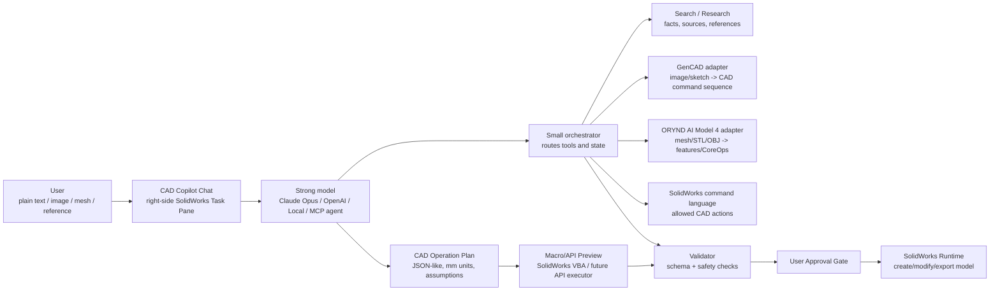

## Chat UI With Sub-Statuses

The chat is not only a text box. It is an execution console.

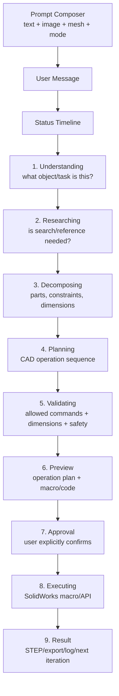

Each status should show:

- what the model is doing now;
- which tool was used, if any;
- what was found or assumed;
- whether the result is ready, blocked, or needs user input.

## What The Strong Model Should Be Told

The central model should receive instructions like this:

```text
You are ORYND CAD Bridge, an engineering CAD copilot.

Think from big to small:
1. Understand the object and user intent.
2. Identify missing dimensions, constraints, year/version, material, and target CAD output.
3. Decide whether search, image/sketch, mesh decomposition, or direct macro planning is needed.
4. Decompose the object into components and CAD features.
5. Build a constrained CAD operation plan using only allowed operations.
6. Include assumptions and warnings.
7. Generate macro/API preview only after the plan is valid.
8. Never execute without explicit user approval.

Use tools only when they improve the result:
- search/research for unknown objects, current specs, references;
- GenCAD adapter for image/sketch reconstruction;
- ORYND AI Model 4 for mesh/STL/OBJ decomposition;
- SolidWorks command catalog for macro/API planning;
- validator before any execution.

If a tool is unavailable, say so and choose the best fallback.
```

## Important Distinction: Model Vs Orchestrator

The strong model is the brain.

The orchestrator is a small router.

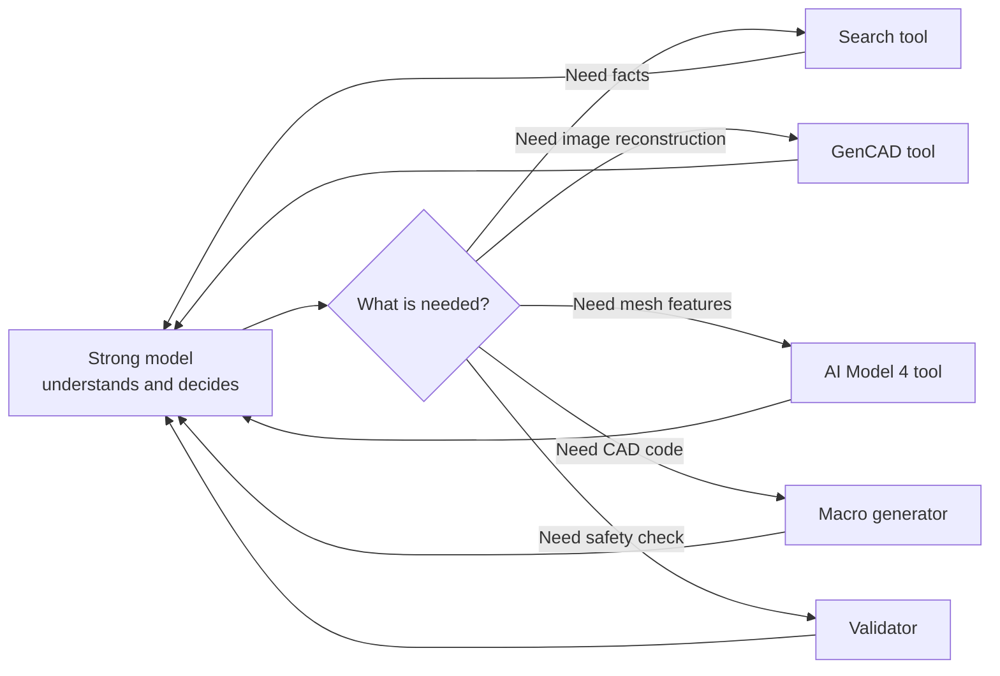

The orchestrator should not overthink.

It should:

- expose tools;
- pass structured inputs;
- store state;
- return tool results;
- keep logs;
- enforce validation and approval.

The strong model should:

- understand the engineering task;
- decide what to do next;
- ask clarifying questions only when needed;
- combine results into a coherent CAD plan.

## Universal Scenario Template

Every scenario should fit this pattern:

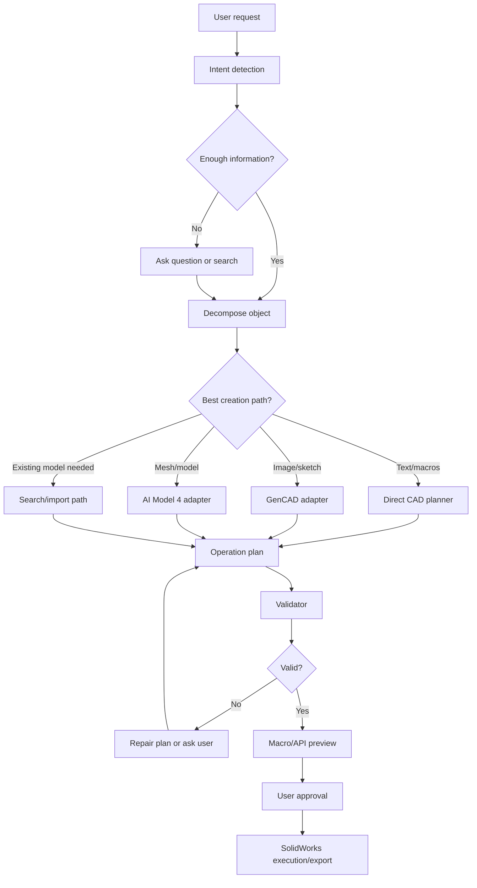

## Scenario 1: Brake Disc From Text

User:

```text
Сделай тормозной диск 280 мм с 5 отверстиями.
```

Expected model thinking:

```text
This is a brake rotor.
Main geometry: round disc.
Needed features:
- outer rotor circle;
- extrusion thickness;
- center bore;
- bolt holes equally spaced on bolt circle;
- optional vent relief;
- edge finishing;
- STEP export.
Missing:
- exact thickness;
- center bore diameter;
- bolt circle diameter;
- bolt-hole diameter.
If missing, use safe demo defaults and show assumptions.
```

Flow:

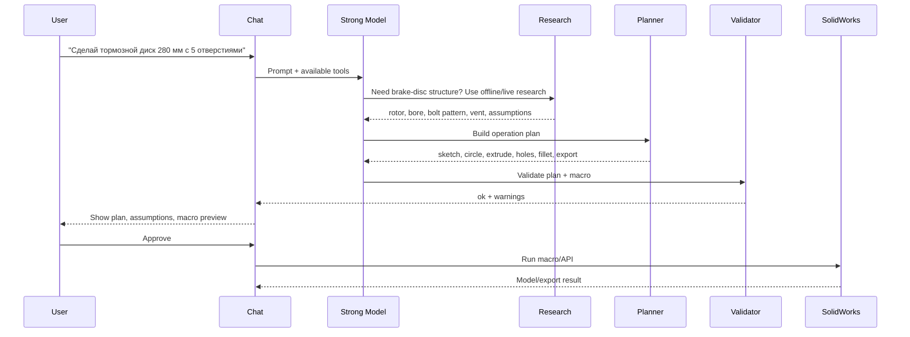

Current prototype status:

- offline scenario exists;
- macro preview exists;
- static validation passes;
- SolidWorks runtime execution is not verified.

## Scenario 2: Mounting Bracket

User:

```text
Сделай кронштейн 160 x 38 x 6 мм с двумя отверстиями M4.
```

Expected thinking:

```text
Simple part. No search needed.
Build directly:
- sketch rectangle;
- extrude base;
- add two M4 clearance holes;
- fillet edges;
- export STEP.
```

Best route:

```text
direct text -> CAD planner -> operation plan -> macro preview -> validation -> approval -> SolidWorks
```

This should be the first real SolidWorks runtime proof because it uses the
smallest reliable command set.

## Scenario 3: Spur Gear

User:

```text
Сделай шестерню 24 зуба, модуль 2.
```

Expected thinking:

```text
This is a gear.
Known formulas:
- pitch diameter = module * teeth;
- outer diameter = pitch diameter + 2 * module.
Need:
- thickness;
- bore diameter;
- true involute or simplified visual gear.
```

Decision:

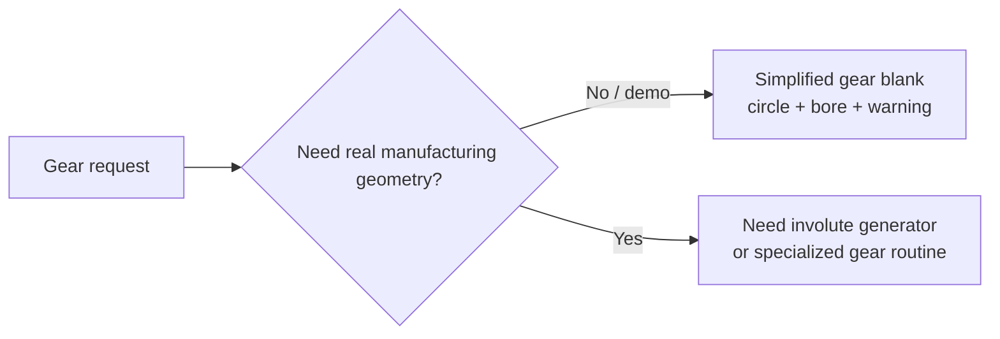

Current prototype:

- simplified gear example exists;
- true involute geometry is not implemented.

## Scenario 4: F1 Front Wing

User:

```text
Сделай переднее крыло F1, поколение 2018.
```

Expected thinking:

```text
This is not a simple primitive.
Need version/year because wing geometry depends on regulation era.
Need reference images or search.
Break into:
- main plane;
- flaps;
- endplates;
- pylons;
- mounting holes;
- aerodynamic surfaces.
```

Flow:

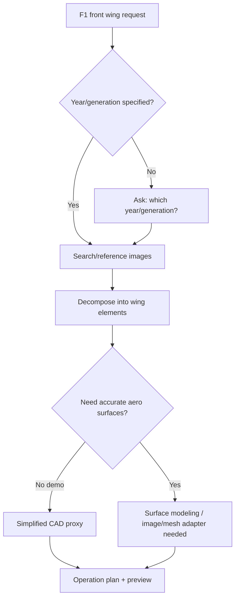

Current prototype:

- simplified F1 front-wing example exists;
- accurate aerodynamic surface generation is not implemented.

## Scenario 5: Full F1 Assembly Iteration

User:

```text
Собери болид F1: корпус, колеса, подвеска. Потом отдельно поработаем со спойлером.
```

Expected model behavior:

1. Identify this as an assembly task, not one part.
2. Ask or infer:
   - year/generation;
   - detail level;
   - visual demo vs engineering assembly;
   - target output: STEP, SolidWorks assembly, separate parts.
3. Decide per component:
   - find/import existing reference model;
   - generate simplified CAD proxy;
   - use mesh decomposition if a model is imported;
   - generate missing parts with macro operations.
4. Build a staged plan:
   - chassis/body;
   - wheels;
   - suspension proxies;
   - front wing/spoiler;
   - mates/placement;
   - export.

Diagram:

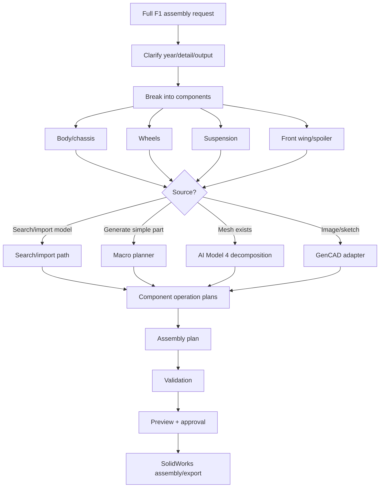

Current prototype:

- no full assembly runtime yet;
- mate operation is only a declaration;
- model search/import is not implemented;
- this scenario is target behavior, not current proof.

## Scenario 6: Image Or Sketch To CAD

User:

```text
Вот скетч детали. Сделай редактируемую CAD-модель.
```

Expected flow:

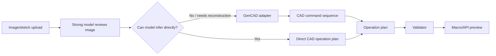

Current prototype:

- image context field exists;
- GenCAD status/run scaffold exists;
- GenCAD is not installed;
- GenCAD output conversion is not implemented.

## Scenario 7: Mesh/STL/OBJ To Editable CAD

User:

```text
У меня есть STL. Разбери его на элементы и сделай STEP.
```

Expected flow:


Current prototype:

- supported primitives can convert:
  - axis-aligned box;
  - Z-axis cylinder;
  - sketch/rectangle/circle/extrude/export;
- full freeform mesh reconstruction is not production-ready.

## Scenario 8: Modify Existing CAD

User:

```text
Открой текущую деталь, добавь два отверстия и увеличь толщину на 3 мм.
```

Expected behavior:

```text
Need current CAD context:
- active document;
- selected face/body;
- dimensions/features;
- editable history if available.
```

Flow:

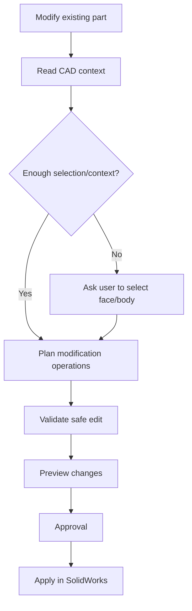

Current prototype:

- current CAD context reading is not implemented;
- SolidWorks add-in preview exists;
- direct edit execution is not implemented.

## Scenario 9: Engineering Question + CAD Action

User:

```text
Какой зазор нужен для M4 болта и сделай кронштейн под это.
```

Expected behavior:

```text
First answer engineering fact:
- M4 clearance commonly around 4.3-4.5 mm depending standard/fit.
Then use selected assumption:
- use 4.5 mm clearance holes unless user specifies otherwise.
Then build CAD plan.
```

Flow:


## Scenario 10: User With Own Claude Subscription Via MCP

Owner idea:

```text
User may not want to pay for a separate API key.
If they already use Claude/Codex-like tools, they may connect through MCP.
```

Target flow:

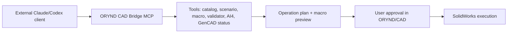

Current prototype:

- stdio MCP server exists;
- tools return catalog/scenario/macro/validation data;
- MCP does not yet execute SolidWorks.

## What "Any Scenario" Means

In the target architecture, the model should be able to handle almost any CAD
request by choosing a route:

```text
simple part -> direct macro planning
unknown object -> search/research first
image/sketch -> GenCAD route
mesh/STL/OBJ -> AI Model 4 route
existing CAD edit -> SolidWorks context route
assembly -> component plans + mate/placement route
engineering question -> answer + CAD plan
```

But this is only true if:

- a strong model route is connected;
- tools are available;
- the command catalog supports the needed operations;
- runtime execution has been verified;
- the user approves before execution.

Current prototype does not yet prove every route.

## Current Reality Check

Works today:

```text
deterministic examples
  -> operation plan
  -> macro preview
  -> static validation
```

Partially works:

```text
brake disc scenario
  -> offline research
  -> decomposition
  -> plan/macro/validation
```

```text
AI Model 4 supported primitives
  -> CoreOps
  -> operation plan
  -> macro/validation
```

Scaffolded:

```text
SolidWorks right-side Task Pane
GenCAD adapter
Supabase auth/subscription flow
MCP as external client bridge
expanded SolidWorks command language
```

Not proven:

```text
real SolidWorks execution
real GenCAD image reconstruction
live search
arbitrary Opus/Claude/OpenAI planner
full assembly/mate runtime
```

## Final Product Goal

The final product should let a user stay inside SolidWorks and say:

```text
Make this part.
Modify this assembly.
Use this sketch.
Find a reference and build it.
Decompose this mesh.
Export the result.
```

The system should then:

1. understand;
2. choose the right path;
3. use search/model/adapters if needed;
4. create a visible operation plan;
5. validate generated code;
6. ask approval;
7. run in SolidWorks;
8. export the result.

That is the target.

The current repo is the foundation and offline proof layer, not the finished
runtime product.
