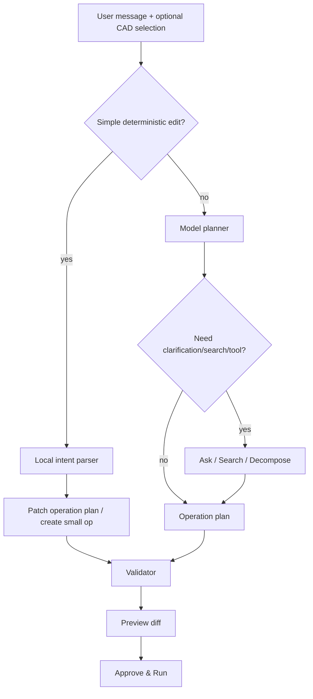

# Selection Context And Chat UX

Date: 2026-06-19

This document captures the new interaction idea:

```text
select something in SolidWorks
  -> invoke ORYND shortcut/context action
  -> selected part/face/feature becomes chat context
  -> user asks for a local edit or reuse
  -> ORYND chooses cheap deterministic edit or model-assisted planning
```

The goal is to make ORYND CAD Bridge feel fast inside CAD, not like every small
change requires a full expensive model run.

## Product Intent

The user should be able to work like this:

```text
1. Generate a brake disc.
2. Click/select the generated disc or one face/hole/feature in SolidWorks.
3. Press a shortcut or click "Use selection in ORYND".
4. The Task Pane receives the selected object as context.
5. User says: "increase this radius", "make two left and two right",
   "repeat this on the other side", "add tires to these wheels".
6. ORYND modifies the right thing without restarting the whole project context.
```

This is different from "new prompt = new project".

The chat must behave like a continuing engineering session.

## Shortcut Concept

Preferred owner idea:

```text
Shift+Tab
```

Meaning:

```text
selected SolidWorks object -> attach/pull into ORYND current chat context
```

Runtime caution:

- `Shift+Tab` often means reverse focus traversal in Windows/web controls.
- SolidWorks users can have custom keyboard shortcuts.
- The add-in may not be able to globally own that shortcut safely in every
  context.

Recommended implementation:

```text
Primary configurable shortcut:
  default proposal: Ctrl+Shift+Space or Ctrl+Alt+O

Optional owner/preferred mapping:
  Shift+Tab, only if tested and non-conflicting in SolidWorks

Fallbacks:
  - Task Pane button: "Use current selection"
  - right-click/context command: "Send selection to ORYND"
  - toolbar command: "Attach selection"
```

Do not hard-code a shortcut as the only access path.

## Selection Context Contract

When the user invokes the selection action, the SolidWorks add-in should collect
a compact structured snapshot.

```json
{
  "selection_id": "sel_2026_06_19_001",
  "chat_id": "chat_brake_disc_project",
  "document": {
    "name": "brake_disc.SLDPRT",
    "type": "part",
    "units": "mm"
  },
  "selection": {
    "kind": "face",
    "name": "Face<12>",
    "owner_feature": "bolt_1_cut",
    "body_name": "disc_body",
    "approx_geometry": {
      "surface_type": "cylindrical",
      "center": {"x": 57.5, "y": 0, "z": 0},
      "radius_mm": 6.0,
      "normal": {"x": 0, "y": 0, "z": 1}
    },
    "bbox_mm": {
      "min": {"x": 51.5, "y": -6, "z": 0},
      "max": {"x": 63.5, "y": 6, "z": 28}
    }
  },
  "source_operation": {
    "operation_id": "bolt_1",
    "command": "hole",
    "args": {
      "center": {"x": 57.5, "y": 0},
      "diameter": 12,
      "through_all": true
    }
  }
}
```

The snapshot should be small. Do not dump the full model unless the user asks
for deep decomposition.

## Selection Types

Support these in priority order:

1. `feature`
   - best for editing generated ORYND operations;
   - can map back to operation id if we store custom metadata.

2. `face`
   - useful for local edits:
     - increase radius;
     - add hole;
     - offset;
     - select sketch plane;
     - apply fillet/chamfer.

3. `edge`
   - useful for fillet/chamfer, measure, pattern references.

4. `body`
   - useful for duplicate, mirror, export, classify, apply appearance.

5. `component`
   - useful in assemblies:
     - duplicate wheel/disc;
     - make left/right pairs;
     - add mates;
     - replace/import component.

6. `sketch entity`
   - useful later, but lower priority for MVP.

## Metadata For Generated Features

Every ORYND-created feature should carry traceable metadata.

Target:

```text
feature/body custom property or naming convention
```

Example names:

```text
ORYND_disc_body
ORYND_bolt_1_cut
ORYND_center_bore_cut
ORYND_bracket_body
ORYND_m4_hole_left
```

Stored metadata:

```json
{
  "orynd_run_id": "run_123",
  "orynd_chat_id": "chat_456",
  "orynd_operation_id": "bolt_1",
  "orynd_command": "hole",
  "orynd_params_mm": {
    "center": {"x": 57.5, "y": 0},
    "diameter": 12
  }
}
```

This enables cheap edits:

```text
"make this hole 14 mm"
  -> selected feature maps to operation `bolt_1`
  -> patch diameter 12 -> 14
  -> validate
  -> preview diff
  -> approve/run
```

## Cheap Edits Without Full AI

Do not spend a large model call for simple local edits.

Use deterministic/local commands when intent is obvious:

| User action | Required AI? | Suggested path |
| --- | --- | --- |
| Select hole + "make 14 mm" | No/low | parse numeric edit -> patch operation |
| Select face + "increase radius by 2 mm" | No/low | direct param edit if feature-linked |
| Select edge + "fillet 2 mm" | No/low | generate fillet op |
| Select body + "export STEP" | No | export op |
| Select component + "duplicate 4 times" | No/low | duplicate/pattern op |
| "make two left and two right discs" | Maybe | deterministic mirror if context clear, model if ambiguous |
| "add tires to these wheels" | Yes | needs planning/search/library |
| "make it like 2018 F1 front wing" | Yes | needs clarification/research |

Recommended routing:



## Chat Continuity

A chat is a persistent CAD project thread, not a single request.

Required concepts:

- `chat_id`
- `run_id`
- `message_id`
- `active_document_id`
- `selected_context_ids`
- `operation_plan_version`
- `macro_version`
- `created_assets`
- `linked_features`

Each user message should be classified as one of:

- `new_object_request`
- `modify_existing_object`
- `clarification_answer`
- `selection_edit`
- `search_request`
- `export_request`
- `settings_or_account_request`
- `general_question`

Important rule:

```text
new message in same chat != new blank project
```

The model/orchestrator must receive a compact session memory:

```json
{
  "chat_summary": "User is building a brake-disc/wheel assembly.",
  "active_document": "brake_disc_assembly.SLDASM",
  "created_assets": [
    {"asset_id": "asset_disc_macro", "name": "brake disc macro", "latest_plan_version": 3},
    {"asset_id": "asset_disc_left", "name": "left brake disc instance"},
    {"asset_id": "asset_disc_right", "name": "right brake disc instance"}
  ],
  "current_selection": ["sel_face_12"],
  "recent_user_intent": "Make two left and two right discs.",
  "constraints": ["Units are mm", "Execution requires approval"]
}
```

Do not resend unlimited raw chat history on every request.
Use:

- recent messages;
- compact chat summary;
- current CAD selection;
- current operation plan;
- relevant assets/macros;
- tool results only when needed.

## Context Window Cost Control

To reduce model cost:

1. Short deterministic edits avoid a model call.
2. Use a small/cheap model for classification:
   - "is this simple edit or planning?"
   - "does this need clarification?"
3. Use the strong model only for:
   - complex planning;
   - unclear engineering intent;
   - search/research synthesis;
   - image/mesh/decomposition interpretation;
   - repair after runtime failure.
4. Store chat/project summaries.
5. Store operation plans as structured JSON and diff them.
6. Send selected feature metadata instead of whole CAD history.

Suggested routing:

```text
message -> local rules
  -> if obvious: deterministic patch
  -> else cheap classifier
  -> if simple: small planner/local parser
  -> if complex: Anthropic/ORYND Cloud route
```

## Clarification Popovers

The UI must support Claude-like clarification choices.

Examples:

```text
"Which F1 generation?"
[Latest current-style] [2018] [2022+] [Let ORYND choose]

"Brake disc target?"
[visual demo] [realistic automotive proportions] [lightweight racing concept]

"Use selected face how?"
[increase hole diameter] [add fillet] [create sketch here] [explain selection]
```

Component:

```text
ClarificationPopover
  - title
  - message
  - choices[]
  - freeform input
  - allow "decide for me"
  - timeout/default optional
```

Behavior:

- shown inline in the chat/status area;
- does not start a new chat;
- answer becomes `clarification_answer`;
- original run resumes with same `run_id` or linked child run.

## Dashboard / Library

The user needs a dashboard for assets generated across chats.

Name ideas:

- `My CAD Library`
- `Macros & Models`
- `Project Assets`
- `Run History`

Recommended dashboard sections:

1. Recent chats/projects
   - brake disc project;
   - F1 wing concept;
   - mounting bracket.

2. Macro/model library
   - saved operation plans;
   - generated macros;
   - exported STEP/STL files;
   - source prompts;
   - latest validation status.

3. Reusable recipes
   - brake disc;
   - spur gear;
   - mounting bracket;
   - wheel/tire assembly;
   - custom user recipes.

4. Active SolidWorks document
   - current file;
   - connection status;
   - selected object;
   - linked ORYND features.

5. Account/model route
   - trial/subscription;
   - BYO key status;
   - ORYND Cloud route;
   - local fallback status.

Asset card data:

```json
{
  "asset_id": "asset_brake_disc_macro",
  "kind": "macro_recipe",
  "name": "Brake disc 280 mm / 5 holes",
  "source_chat_id": "chat_456",
  "latest_plan_version": 3,
  "created_at": "2026-06-19T09:00:00Z",
  "operations": 12,
  "last_validation": "passed_with_warnings",
  "outputs": ["brake_disc.step", "brake_disc.bas"],
  "actions": ["open", "duplicate", "edit parameters", "insert into active assembly"]
}
```

## Reusing One Macro For Multiple Instances

Owner example:

```text
Why make four separate brake-disc macros if one brake-disc macro can create
multiple instances?
```

Correct model:

```text
macro recipe -> parameterized asset -> instances in document/assembly
```

Example:

```json
{
  "recipe": "brake_disc",
  "parameters": {
    "diameter": 280,
    "thickness": 28,
    "bolt_count": 5,
    "bolt_circle_diameter": 115
  },
  "instances": [
    {"name": "front_left_disc", "transform": {"x": -720, "y": 1200, "z": 0}, "side": "left"},
    {"name": "front_right_disc", "transform": {"x": 720, "y": 1200, "z": 0}, "side": "right"},
    {"name": "rear_left_disc", "transform": {"x": -720, "y": -1200, "z": 0}, "side": "left"},
    {"name": "rear_right_disc", "transform": {"x": 720, "y": -1200, "z": 0}, "side": "right"}
  ]
}
```

Then:

```text
"make two left and two right"
  -> classify selected/created discs
  -> mirror/rename/transform instances
  -> validate assembly plan
  -> preview
  -> approve
```

## Runtime Events To Add

Extend `RUNTIME_EVENTS.md` with:

- `selection_captured`
- `selection_context_ready`
- `selection_context_failed`
- `clarification_required`
- `clarification_answered`
- `chat_summary_updated`
- `asset_saved`
- `asset_reused`
- `plan_patched`
- `cheap_edit_applied`
- `model_route_escalated`

Example:

```json
{
  "run_id": "run_123",
  "type": "selection_context_ready",
  "title": "Selection attached",
  "message": "Face from bolt_1_cut is now attached to this chat.",
  "progress": 1,
  "payload": {
    "selection_id": "sel_2026_06_19_001",
    "kind": "face",
    "owner_feature": "bolt_1_cut",
    "source_operation_id": "bolt_1"
  }
}
```

## Implementation Steps

1. Add add-in command: `Attach current selection to ORYND`.
2. Add configurable shortcut mapping.
3. Add selection snapshot schema.
4. Add local bridge endpoint:

```text
POST /api/cad/selection-context
```

5. Store selection context in current `chat_id`.
6. Add deterministic edit classifier:

```text
selection + short user text -> cheap edit or model route
```

7. Add clarification popover component/state.
8. Add dashboard/library data model.
9. Add feature metadata naming/custom properties in generated macro/add-in runner.
10. Add tests:
    - selection snapshot parse;
    - simple edit classification;
    - operation patch validation;
    - same chat continuation;
    - clarification answer resumes run;
    - asset recipe reuse.

## MVP Scope

Do first:

- attach current selection;
- show selected object chip in Task Pane;
- edit selected ORYND-generated hole diameter;
- fillet selected edge;
- export selected body;
- save generated macro/plan to library;
- resume same chat context.

Do later:

- arbitrary face geometry recognition;
- full assembly intelligence;
- global `Shift+Tab` if conflicts are resolved;
- automatic left/right semantic reasoning across complex assemblies;
- deep mesh/feature reverse-engineering from arbitrary imported parts.

## Design Prompt Addendum

When updating the visual design, include these new components:

- `SelectionContextChip`
- `AttachSelectionButton`
- `SelectionInspector`
- `ClarificationPopover`
- `ClarificationChoice`
- `ChatSessionHeader`
- `ContextMemoryPanel`
- `AssetLibraryDashboard`
- `MacroRecipeCard`
- `ModelAssetCard`
- `RunHistoryList`
- `CheapEditPreview`
- `PlanDiffCard`

New Task Pane states:

- `selection_attached`
- `clarification_required`
- `cheap_edit_preview`
- `plan_diff_ready`
- `asset_saved`
- `library_browsing`

The UI should make it obvious whether ORYND is:

- continuing the current chat;
- editing the current selection;
- creating a new object;
- reusing an existing macro/recipe;
- escalating to a strong model route.

